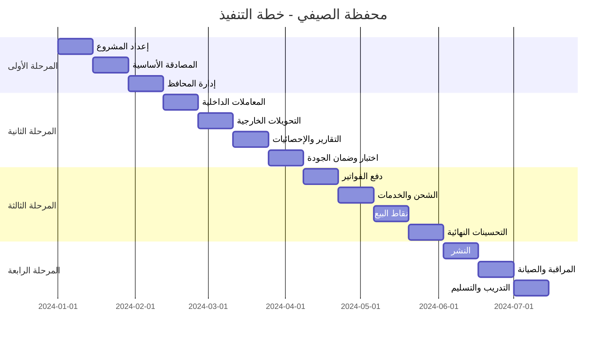

# خطة التنفيذ والجداول الزمنية - محفظة الصيفي

## 1. مراحل المشروع (Project Phases)

### المرحلة الأولى: الأساسيات (4-6 أسابيع)
**الهدف:** بناء البنية التحتية الأساسية والمصادقة

#### الأسبوع 1-2: إعداد المشروع والبيئة
- [x] تصميم قاعدة البيانات
- [x] تخطيط الـ API Endpoints
- [ ] إعداد مشروع Django
- [ ] تكوين PostgreSQL و Redis
- [ ] إعداد Docker containers
- [ ] تكوين CI/CD pipeline
## Batch 3: Input Validation & UX (Completed)
- [x] Implement specific length validation for payment screens
    - [x] 9 digits for Mobile Recharge & Packages (Shahn & Sadaad)
    - [x] 8 digits for Internet Payment
    - [x] 10 digits for 4G Services (Yemen 4G)
    - [x] Add real-time red error text for insufficient digits
    - [x] Apply input formatters to limit maximum length
- [/] Final visual audit of all screens

#### الأسبوع 3-4: نظام المصادقة
- [ ] إنشاء نماذج المستخدمين
- [ ] تطبيق JWT authentication
- [ ] المصادقة الثنائية (2FA)
- [ ] المصادقة البيومترية
- [ ] اختبارات الأمان

#### الأسبوع 5-6: إدارة المحافظ
- [ ] إنشاء نماذج المحافظ
- [ ] عمليات المحافظ الأساسية
- [ ] إدارة الأرصدة
- [ ] القيود والحدود اليومية
- [ ] اختبارات الوحدة

### المرحلة الثانية: المعاملات المالية (6-8 أسابيع)
**الهدف:** تطوير نظام المعاملات الأساسي

#### الأسبوع 7-8: المعاملات الداخلية
- [ ] نماذج المعاملات
- [ ] التحويل بين المحافظ
- [ ] التحويل بين المستخدمين
- [ ] التحقق من صحة المعاملات
- [ ] نظام العمولة

#### الأسبوع 9-10: التحويلات الخارجية
- [ ] التحويل إلى البنوك
- [ ] التحويل إلى محافظ أخرى
- [ ] حوالات الشبكات المحلية
- [ ] تكامل مع بوابات الدفع
- [ ] معالجة الأخطاء

#### الأسبوع 11-12: التقارير والإحصائيات
- [ ] نظام التقارير
- [ ] تحليلات المعاملات
- [ ] كشوف الحسابات
- [ ] تصدير البيانات
- [ ] لوحة تحكم المشرف

#### الأسبوع 13-14: اختبار وضمان الجودة
- [ ] اختبارات التكامل
- [ ] اختبارات الأداء
- [ ] اختبارات الأمان
- [ ] اختبارات الإجهاد
- [ ] إصلاح الأخطاء

### المرحلة الثالثة: الخدمات المتقدمة (6-8 أسابيع)
**الهدف:** إضافة الخدمات المالية المتقدمة

#### الأسبوع 15-16: دفع الفواتير
- [ ] نظام دفع الفواتير
- [ ] تكامل مع مزودي الخدمات
- [ ] فواتير الكهرباء والمياه
- [ ] فواتير الاتصالات
- [ ] نظام التنبيهات

#### الأسبوع 17-18: الشحن والخدمات
- [ ] شحن رصيد الهواتف
- [ ] شحن الإنترنت
- [ ] خدمات حكومية (سداد)
- [ ] دفع الخدمات العامة
- [ ] نظام الكوبونات

#### الأسبوع 19-20: نقاط البيع
- [ ] نظام التجار
- [ ] تطبيقات نقاط البيع
- [ ] نظام العمولات
- [ ] تقارير التجار
- [ ] دعم الأجهزة

#### الأسبوع 21-22: التحسينات النهائية
- [ ] تحسين الأداء
- [ ] تحسين واجهة المستخدم
- [ ] إضافة ميزات إضافية
- [ ] اختبارات نهائية
- [ ] توثيق API

### المرحلة الرابعة: النشر والتشغيل (4-6 أسابيع)
**الهدف:** النشر في بيئة الإنتاج والتشغيل

#### الأسبوع 23-24: النشر
- [ ] إعداد خوادم الإنتاج
- [ ] تكوين النطاقات و SSL
- [ ] نشر قاعدة البيانات
- [ ] تهجير البيانات
- [ ] اختبار الإنتاج

#### الأسبوع 25-26: المراقبة والصيانة
- [ ] إعداد أنظمة المراقبة
- [ ] تنبيهات الأمان
- [ ] نسخ احتياطي تلقائي
- [ ] نظام استعادة البيانات
- [ ] دعم فني 24/7

#### الأسبوع 27-28: التدريب والتسليم
- [ ] تدريب فريق التشغيل
- [ ] توثيق فني كامل
- [ ] أدوات الإدارة
- [ ] تسليم المشروع
- [ ] دعم ما بعد الإطلاق

## 2. الجدول الزمني المفصل (Detailed Timeline)

## 3. الموارد المطلوبة (Required Resources)

### 3.1 الفريق التقني
- **مطور Django Senior** (1 شخص) - 28 أسبوع
- **مطور Backend** (2 شخص) - 24 أسبوع
- **مطور Frontend** (1 شخص) - 20 أسبوع
- **خبير أمان** (1 شخص) - 12 أسبوع
- **مختبر QA** (1 شخص) - 16 أسبوع
- **مدير مشروع** (1 شخص) - 28 أسبوع
- **مهندس DevOps** (1 شخص) - 8 أسابيع

### 3.2 البنية التحتية
- **خوادم الإنتاج:** 4 خوادم (Web, Database, Redis, Load Balancer)
- **قاعدة البيانات:** PostgreSQL مع النسخ المتماثل
- **التخزين:** 500GB SSD للبيانات و 1TB للنسخ الاحتياطي
- **الشبكة:** نطاق SSL شهادة، CDN للملفات الثابتة
- **المراقبة:** Sentry, New Relic, Grafana

### 3.3 التكاليف التقديرية
- **تكاليف التطوير:** 150,000 - 200,000 دولار
- **تكاليف البنية التحتية:** 20,000 - 30,000 دولار سنوياً
- **تكاليف التشغيل:** 10,000 - 15,000 دولار سنوياً
- **تكاليف الصيانة:** 15,000 - 25,000 دولار سنوياً

## 4. المخاطر والتحديات (Risks & Challenges)

### 4.1 المخاطر التقنية
- **أمان البيانات:** مخاطر اختراق البيانات المالية
- **قابلية التوسع:** تحمل عدد كبير من المستخدمين
- **التكامل مع البنوك:** صعوبة التكامل مع الأنظمة المصرفية
- **الأداء:** سرعة المعاملات في أوقات الذروة

### 4.2 المخاطر التنظيمية
- **التراخيص:** الحصول على تراخيص من البنك المركزي
- **الامتثال:** الامتثال للوائح المالية
- **الخصوصية:** حماية بيانات المستخدمين
- **الضرائب:** التعامل مع الضرائب المالية

### 4.3 مخاطر السوق
- **المنافسة:** تطبيقات محافظ أخرى
- **قبول المستخدمين:** صعوبة جذب المستخدمين
- **الثقة:** بناء ثقة المستخدمين في النظام
- **التغيرات التكنولوجية:** تطور التقنيات المالية

## 5. مؤشرات الأداء الرئيسية (KPIs)

### 5.1 مؤشرات التطوير
- **سرعة التطوير:** عدد الميزات المنجزة شهرياً
- **جودة الكود:** عدد الأخطاء لكل 1000 سطر كود
- **تغطية الاختبارات:** نسبة الكود المشمول بالاختبارات
- **أداء النظام:** زمن استجابة الـ API

### 5.2 مؤشرات الأعمال
- **عدد المستخدمين:** إجمالي المستخدمين النشطين
- **حجم المعاملات:** قيمة المعاملات اليومية
- **الإيرادات:** العمولة والعمولات
- **رضا العملاء:** تقييمات المستخدمين

### 5.3 مؤشرات التشغيل
- **وقت التشغيل:** نسبة توفر النظام
- **زمن الاستجابة:** متوسط زمن استجابة المعاملات
- **معدل الأخطاء:** نسبة المعاملات الفاشلة
- **دعم العملاء:** وقت حل المشاكل

## 6. خطة النشر (Deployment Plan)

### 6.1 البيئات
- **بيئة التطوير (Development):** للفرق التقنية
- **بيئة الاختبار (Testing):** لاختبار الميزات
- **بيئة الإنتاج (Production):** للمستخدمين النهائيين
- **بيئة الطوارئ (Disaster Recovery):** للنسخ الاحتياطي

### 6.2 استراتيجية النشر
- **النشر التدريجي:** إطلاق الميزات تدريجياً
- **الاختبار A/B:** اختبار الميزات على عينة من المستخدمين
- **النشر الأزرق/أخضر:** نشر بدون توقف
- **التراجع السريع:** القدرة على التراجع السريع عند المشاكل

## 7. الصيانة والدعم (Maintenance & Support)

### 7.1 الصيانة الوقائية
- **تحديثات الأمان:** تحديثات شهرية
- **تحسين الأداء:** مراجعة ربع سنوية
- **النسخ الاحتياطي:** يومي مع اختبار شهري
- **مراجعة الكود:** مراجعة دورية للكود

### 7.2 دعم المستخدمين
- **دعم فني 24/7:** عبر الهاتف والبريد الإلكتروني
- **قاعدة المعرفة:** وثائق للمستخدمين
- **فيديوهات تعليمية:** دليل مرئي للاستخدام
- **منتدى الدعم:** مجتمع للمساعدة المتبادلة

## 8. التطوير المستمر (Continuous Improvement)

### 8.1 خارطة الطريق المستقبلية
- **المرحلة الخامسة:** الذكاء الاصطناعي والتحليلات المتقدمة
- **المرحلة السادسة:** التوسع الجغرافي
- **المرحلة السابعة:** خدمات مالية إضافية
- **المرحلة الثامنة:** التكامل مع الأنظمة العالمية

### 8.2 الابتكار
- **البحث والتطوير:** استثمار 10% من الميزانية في الابتكار
- **شراكات استراتيجية:** مع البنوك وشركات التكنولوجيا
- **مختبر الأفكار:** اختبار أفكار جديدة
- **التغذية الراجعة:** جمع آراء المستخدمين باستمرار